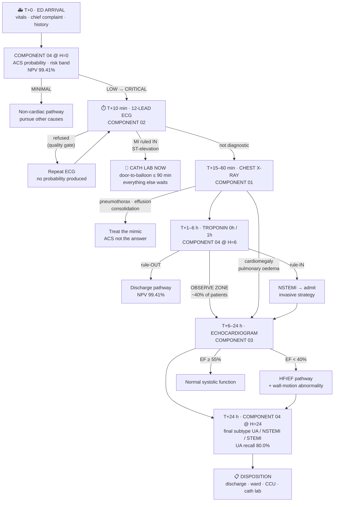

# Clinical Workflow — R26-IT-083

**Explainable AI System for Cardiovascular Disease Detection and Diagnosis**

The order in which the four components fire, mapped onto the real pathway a
patient follows from the emergency-department door to disposition.

> ⚕️ **Research prototype. Not a medical device.** Nothing here is clinically
> validated and nothing here is a diagnosis. Every output requires review by a
> qualified clinician. This document describes an *ordering*, not a standard of
> care — the guideline references exist to justify the sequence, not to
> substitute for the guidelines themselves.

---

## 1. The answer in one line

**Component 04 → Component 02 → Component 01 → Component 04 → Component 03 → Component 04.**

Component 04 is not one step. It is the **spine** of the pathway, and it runs
**three times** — once at each of its declared feature horizons. The other three
components slot into the gaps between those horizons.

| # | Clock | Component | Clinical act | The question it answers |
|---|---|---|---|---|
| 1 | **T + 0 min** | **04** @ H=0 | Triage assessment | Is this patient a possible ACS? |
| 2 | **T + 10 min** | **02** | 12-lead ECG | Is there an infarct pattern *right now*? |
| 3 | **T + 15–60 min** | **01** | Chest radiograph | What else could be killing them? Is the heart enlarged? |
| 4 | **T + 1–6 h** | **04** @ H=6 | Troponin 0 h / 1 h back | Does the biomarker confirm it? |
| 5 | **T + 6–24 h** | **03** | Echocardiogram | How well is the pump actually working? |
| 6 | **T + 24 h** | **04** @ H=24 | Workup complete | Final subtype: UA / NSTEMI / STEMI? |

---

## 2. First, a correction worth making

> *"In Component 4 there are lab values, which is the first thing any doctor asks."*

Half right, and the half that is wrong matters.

**Component 04 is genuinely first — but not because of the labs.** At its H = 0
horizon the laboratory channel carries **exactly 0.0 % SHAP attribution**. No
troponin exists ten seconds after a patient walks through the door, and the
component proves it does not use one. What it uses at H = 0 is what a triage
nurse actually has: vitals, chief complaint, free-text history, demographics,
prior history.

**The labs are step 4, not step 1.** In the raw MIMIC-IV-ED data troponin was
drawn a median of **21.8 hours** after arrival — this component was rebuilt
specifically because an earlier version had been reading labs that did not yet
exist at the decision point.

**And the first *test* is not a lab at all — it is the ECG.** Every major
guideline mandates a 12-lead ECG within **10 minutes** of arrival. Troponin
cannot come first, because a STEMI must be caught and sent to the cath lab
before any biomarker has time to return.

So the real order is: **history and vitals → ECG → imaging → troponin → echo.**
Component 04's three horizons are precisely a model of that timeline.

---

## 3. The pathway



---

## 4. Step by step — what happens, and what happens next

### Stage 0 — Pre-hospital (optional)

An EMS crew may acquire a 12-lead ECG in the ambulance. Component 04 allows for
this explicitly: `ecg_lookback_h: 1.0` lets an ECG **precede** ED arrival by up
to an hour without counting as a temporal leak.

**Next:** the patient arrives; the clock (T₀ = `edstays.intime`) starts.

---

### Stage 1 — T + 0 min · Triage → **Component 04 at H = 0**

**What the clinician does.** Takes vitals, records the chief complaint, asks the
history. No test has been ordered yet.

**What the component does.** Featurises only what is knowable at H = 0 — vitals
(38), free text (64), demographics (16), prior history (16), medications (16).
The lab channel is present but **empty by construction**, and is *shown* to be
empty: 0.0 % SHAP attribution.

**What comes out.**

| Output | Value |
|---|---|
| Four-class probability | `No_ACS` / `UA` / `NSTEMI` / `STEMI` |
| Risk band | `CRITICAL` ≥ 0.80 · `HIGH` ≥ 0.50 · `MODERATE` ≥ 0.20 · `LOW` ≥ 0.05 · `MINIMAL` |
| Stage-1 screen | AUROC 0.9560, sensitivity 91.35 %, **NPV 99.41 %** |

**Why it is a screen and not a diagnosis.** At 5.6 % prevalence, positive-class
F1 ≥ 0.75 would need a positive likelihood ratio of 27–50. High-sensitivity
troponin itself only achieves 10–25. So this operating point is tuned to **NPV**
— the metric every cardiology rule-out pathway uses — not to precision.

**When it refuses.** Below the declared feature-availability horizon, or when
the constrained decision layer's top-two margin falls under the frozen cut-off,
it returns a **clinician referral** rather than a subtype.

**➡️ What happens next:** `LOW` and above enter the chest-pain fast track. The
single most urgent act is now the ECG.

> **Corrected from an earlier draft, which exited on `MINIMAL` *or* `LOW`.**
> Measured on the curated demo records at H = 0, a genuine STEMI scores `LOW`
> (P(ACS) = 0.111), as do a genuine NSTEMI (0.053) and an unstable angina
> (0.109); only the non-cardiac record reaches `MINIMAL` (0.000). The band
> boundary sits at 0.05 against a cohort prevalence of 5.6 %, so `LOW` spans
> "at the base rate" to "four times the base rate" — not a rule-out. Exiting
> there sent all three genuine coronary syndromes home before the
> guideline-mandated ECG. The screen's published operating point already pairs
> NPV 99.41 % with sensitivity 91.35 %, so roughly one ACS in eleven is missed
> at `MINIMAL` alone; widening the exit compounds that at exactly the wrong
> moment. Stage 4 keeps the wider `MINIMAL`/`LOW` rule-out, because the
> biomarker licenses a discharge the triage assessment alone does not.

---

### Stage 2 — T + 10 min · 12-lead ECG → **Component 02**

**This is the hard deadline of the whole pathway.** The 2023 ESC ACS guideline
requires a 12-lead ECG performed *and interpreted* within **10 minutes** of
arrival. If the first ECG is non-diagnostic but symptoms persist, repeat it at
15–30 minute intervals during the first hour.

**What the component does, in order:**

```
quality gate ──► preprocess ──► classify ──► calibrate ──► conformal triage
     │                                            │
     │  electrode + scope checks                  ▼
     │  (withhold guarantees)          XAI ──► report ──► verify
```

The **quality gate runs before the classifier**, so a refused record never
produces a probability at all. This is the correct order for a safety system: an
uninterpretable ECG must not be able to yield a reassuring number.

**Five superclasses,** test fold 10 (n = 1,711), never used to select anything:

| Class | Recall | **NPV** | Meaning |
|---|---|---|---|
| NORM | 0.796 | 0.868 | Normal ECG |
| **MI** | 0.836 | **0.967** | Myocardial infarction |
| STTC | 0.803 | 0.926 | ST/T change |
| CD | 0.805 | 0.921 | Conduction disturbance |
| HYP | 0.811 | **0.981** | Hypertrophy |
| **Macro** | **0.810** | **0.933** | accuracy 0.864 |

**The four refusal modes — each maps to a real failure:**

| Signal | Meaning | Required response |
|---|---|---|
| `refused: true` | Failed quality control | **No probabilities exist.** Not "normal". Repeat the ECG. |
| `electrode.suspected` | Limb-electrode reversal | Probabilities returned, **guarantees void**. Repeat. |
| `scope.outOfScope` | Irregularly irregular R-R — AF/flutter | **Arrhythmia has NOT been excluded.** Five-class result is not a complete interpretation. |
| `verification.passed: false` | Generated text failed safety check | Do not display as a report. |

**➡️ What happens next — this is the pathway's main branch:**

- **MI ruled in / ST-elevation → the workup stops here.** Activate the cath lab.
  Door-to-balloon ≤ 90 minutes. In-hospital mortality is 8 % under 90 minutes
  versus 20 % over. **No X-ray, no troponin, no echo is allowed to delay
  reperfusion.** Components 01, 03 and 04's later horizons resume *after* PCI.
- **Non-diagnostic ECG →** continue to Stage 3, and repeat the ECG at 15–30 min.

---

### Stage 3 — T + 15–60 min · Chest radiograph → **Component 01**

**Why here, and why not later.** The CXR is not an ACS test. It is the
**differential-diagnosis step** — chest pain accounts for up to 10 % of ED
attendances, and the initial evaluation must exclude aortic dissection,
pulmonary embolism, pneumothorax, pneumomediastinum, pericarditis and
oesophageal perforation. It is usually a portable film taken in the resus bay,
so in practice it overlaps Stage 4 rather than strictly preceding it.

**What comes out** — one forward pass, eight pathologies:

| Pathology | AUROC | Sensitivity | Role in this pathway |
|---|---|---|---|
| **Cardiomegaly** | **0.9189** | **92.3 %** | → triggers Stage 5 (echo) |
| Pleural Effusion | 0.9289 | 81.2 % | congestion / mimic |
| Pneumothorax | 0.9141 | 54.0 % | **immediate mimic** |
| Edema | 0.9132 | 75.9 % | → suggests heart failure |
| Consolidation | 0.8167 | 38.4 % | pneumonia mimic |
| Atelectasis | 0.8096 | 79.3 % | incidental |
| Pneumonia | 0.7959 | 31.1 % | mimic |
| Lung Opacity | 0.7462 | 61.6 % | non-specific |

Plus a **Grad-CAM heatmap** per pathology — so a radiologist can see whether the
model attended to the cardiac silhouette or to a piece of tubing — and a **draft
report** whose training targets were cleaned so that fabricated prior-study
references sit at exactly **0.0000** across all 4,722 test images.

**When it defers.** Operating points are **per projection**. AP films measure
AUROC 0.8224 against 0.8864 on PA, so the AP deferral margin is 0.2247 against
PA's 0.0029. A borderline AP film — the portable, sicker-patient view — is
deferred rather than called.

**➡️ What happens next:**

- **Pneumothorax / consolidation / effusion →** treat the mimic; ACS may not be
  the answer at all.
- **Cardiomegaly or oedema →** jump to Stage 5. The heart is structurally
  abnormal and needs quantifying.
- **Otherwise →** Stage 4, waiting on the biomarker.

---

### Stage 4 — T + 1–6 h · Troponin → **Component 04 at H = 6**

**What the clinician does.** High-sensitivity troponin at presentation and at
1 hour (the ESC 0/1 h algorithm), triaging into **rule-out**, **rule-in**, or
the **observe zone**. About 58–59 % of patients are resolved; **40–41 % land in
the observe zone.**

**What changes in the model.** The same cohort, the same split, the same code —
re-featurised at H = 6. The lab channel now carries real attribution, and one
number moves dramatically:

| Class | H = 0 | **H = 6** | H = 24 |
|---|---|---|---|
| **UA recall** | 37.3 % | **58.2 %** | **80.0 %** |

**This is the most clinically meaningful result in the system.** Unstable angina
is *defined* as ACS with a normal troponin — so it is literally not identifiable
until the biomarker returns. The horizon curve recovers that clinical fact from
the data rather than being told it.

**➡️ What happens next:**

- **Rule-out →** discharge pathway, backed by NPV 99.41 %.
- **Rule-in →** NSTEMI; admit for an invasive strategy → Stage 5.
- **Observe zone →** Stage 5. Guidelines recommend transthoracic echo precisely
  for patients eligible for neither rule-out nor rule-in.

---

### Stage 5 — T + 6–24 h · Echocardiogram → **Component 03**

**Why the echo is last and not first.** It answers a different question from the
other three. Components 01, 02 and 04 all ask *"is this an acute coronary
event?"* The echo asks **"how well is the pump working, and is there structural
damage?"** — which is a question about consequence, not about the acute event.
It requires a sonographer, so it is scheduled rather than instant.

**Three things route a patient here:**

1. **Observe zone** at Stage 4 — neither ruled in nor out.
2. **Cardiomegaly or pulmonary oedema** on the Stage 3 film.
3. **After primary PCI** — routine TTE to assess LV function, exclude early
   mechanical complications and screen for LV thrombus.

**What comes out.** Continuous EF plus a four-class severity grade:

| Grade | EF range | Maps to |
|---|---|---|
| **Severe** | < 30 % | HFrEF |
| **Moderate** | 30–40 % | HFrEF |
| **Mild** | 40–55 % | spans HFmrEF (41–49) and HFpEF (≥ 50) |
| **Normal** | ≥ 55 % | preserved |

Against the universal definition of heart failure — **HFrEF ≤ 40 %, HFmrEF
41–49 %, HFpEF ≥ 50 %** — the component's Severe and Moderate bands sit entirely
inside HFrEF, and its 40 % boundary is the clinically decisive one.

Performance: **MAE 3.979 EF points**, 73.0 % overall accuracy, minimum per-class
recall 0.723 on the untouched test split (n = 1,277).

**When it hedges — three separate mechanisms:**

- **Split-conformal EF interval** — a calibrated range, not a point estimate.
- **Learned aleatoric σ** — the model's own estimate of measurement noise.
  Inter-observer variability on EF is ≈ 4 EF points, so a single number was
  never honest to begin with.
- **Inter-clip epistemic disagreement** — if ten sampled clips of the same study
  disagree, that is reported rather than averaged away.

**➡️ What happens next:** EF < 40 % opens the heart-failure pathway alongside
the ACS one. Either way, proceed to Stage 6.

---

### Stage 6 — T + 24 h · Workup complete → **Component 04 at H = 24**

Every feature is now knowable. This is the **headline model** — the
deployment configuration, and the one the backend serves by default.

**Why the unified four-class model (UM4), not the two-stage cascade.** A cascade
compounds error: a patient Stage 1 misses can never be recovered by Stage 2.
Fitting all four boundaries jointly moved **STEMI recall from 58.16 % to
79.82 %**.

| Metric | Value |
|---|---|
| Subtyping macro-F1 | 0.7448 |
| UA recall | **80.0 %** (from 37.3 % at H = 0) |
| Test fold | patient-disjoint, n = 30,452 |

**The referral threshold.** UM4's published operating points are stated as a
*coverage* (85 % or 65 %) — a population-level quantity. A single patient has no
cohort, so the coverage is converted once, at load, into an absolute cut-off on
the top-two margin, taken as the (1 − coverage) quantile over the component's
persisted **validation** scores. Validation, never test.

**➡️ What happens next:** disposition — discharge, ward, CCU, or cath lab.

---

## 5. Why this order and not another

| Decision | Justification |
|---|---|
| **Triage assessment before any test** | It is the only information that exists at T₀. Component 04's H = 0 horizon models exactly this, and proves it uses no labs (0.0 % lab SHAP). |
| **ECG before troponin** | Guideline-mandated within 10 min of arrival. A STEMI must reach the cath lab before any biomarker returns; door-to-balloon ≤ 90 min. |
| **CXR before/alongside troponin** | Its job is excluding non-cardiac killers, which cannot wait an hour for a biomarker. |
| **Troponin at 0 h and 1 h** | The ESC 0/1 h algorithm. Resolves ~59 % of patients; the rest enter the observe zone. |
| **Echo after troponin** | Guidelines recommend TTE specifically for observe-zone patients, and routinely after primary PCI. It also needs a sonographer. |
| **Final subtyping last** | UA is *defined* by a normal troponin, so it cannot be separated from NSTEMI until the biomarker is back. UA recall 37.3 % → 80.0 % is that fact, measured. |

---

## 6. What ties the four together

The four answer different clinical questions and share no findings — a
cardiomegaly probability and an ejection fraction have nothing in common. What
they share is that **each was built around a mechanism that declines to commit
when its own evidence is weak.**

| Component | Its honesty mechanism |
|---|---|
| **01** | Per-projection operating points; selective deferral (AP margin 0.2247 vs PA 0.0029) |
| **02** | Quality gate *before* any probability exists; conformal zones; guarantee withdrawal on electrode reversal or out-of-scope rhythm |
| **03** | Split-conformal EF interval; learned aleatoric σ; inter-clip epistemic disagreement |
| **04** | Declared feature-availability horizon; constrained decision layer; clinician referral |

The backend normalises those four vocabularies into **one `actionability`
verdict** — `actionable` / `caution` / `deferred` / `withheld` / `unavailable` —
so a caller applies one rule across all four modalities:

> **Do not act on a result that is not `actionable`.**

The console makes that verdict control the visual hierarchy rather than sit in a
corner badge. `withheld` findings are **not rendered at all**, because showing a
suppressed probability beside a warning invites it to be used anyway.

---

## 7. Limits this workflow does not overcome

- **No component diagnoses anything.** Four decision-support outputs, each
  requiring clinician review.
- **The components share no patients.** MIMIC-CXR, PTB-XL, EchoNet-Dynamic/CAMUS
  and MIMIC-IV-ED are four separate cohorts. The pathway above is how the
  components *would* compose clinically — it is not a validated end-to-end study
  on one population.
- **Component 02 recognises five superclasses.** Atrial fibrillation and other
  arrhythmias are outside the label space; the scope check flags 48.9 % of
  irregular out-of-scope rhythms, and regular ones (paced, monomorphic VT,
  Brugada, long QT) remain silent failures.
- **Component 04's UA/NSTEMI boundary rests on ICD coding**, not adjudicated
  labels.
- **Component 01 is frontal-view only** (AP and PA).
- **Component 03's Mild band (40–55 %) straddles** HFmrEF and HFpEF, so it does
  not by itself separate those two guideline categories.

---

## 8. References

Clinical guidelines and evidence used to justify the ordering:

1. [2023 ESC Guidelines for the management of acute coronary syndromes](https://academic.oup.com/eurheartj/article/44/38/3720/7243210) — *European Heart Journal* (ECG within 10 min of arrival; serial ECGs at 15–30 min).
2. [2021 AHA/ACC/ASE/CHEST/SAEM/SCCT/SCMR Guideline for the Evaluation and Diagnosis of Chest Pain](https://www.ahajournals.org/doi/10.1161/CIR.0000000000001029) — *Circulation* (initial evaluation goals; Class 1 TTE for ventricular/valvular function and wall-motion abnormality).
3. [Novel Criteria for the Observe-Zone of the ESC 0/1h-hs-cTnT Algorithm](https://www.ahajournals.org/doi/10.1161/CIRCULATIONAHA.120.052982) — *Circulation* (rule-out / rule-in / observe zone; ~40 % observe).
4. [Prospective Validation of the 0/1-h Algorithm for Early Diagnosis of Myocardial Infarction](https://www.jacc.org/doi/10.1016/j.jacc.2018.05.040) — *JACC*.
5. [Classification of Heart Failure According to Ejection Fraction: JACC Review Topic of the Week](https://www.jacc.org/doi/10.1016/j.jacc.2021.04.070) — *JACC* (HFrEF ≤ 40 %, HFmrEF 41–49 %, HFpEF ≥ 50 %).
6. [The use of echocardiography in acute cardiovascular care](https://www.escardio.org/static-file/Escardio/Subspecialty/EACVI/position-papers/echocardiography-acute-cardiovascular-care.pdf) — EACVI/ESC position paper.
7. [Chest CT examinations in patients presenting with acute chest pain: a pictorial review](https://www.ncbi.nlm.nih.gov/pmc/articles/PMC4656238/) — chest pain ≈ 10 % of ED attendances; life-threatening differentials.
8. [Achieving door-to-balloon time ≤ 90 minutes in ST-elevation myocardial infarction](https://pmc.ncbi.nlm.nih.gov/articles/PMC13094172/) — reperfusion time target and mortality.
9. [Deep Learning Analysis of Chest Radiographs to Triage Patients with Acute Chest Pain Syndrome](https://pubs.rsna.org/doi/full/10.1148/radiol.221926) — *Radiology* (CXR triage in acute chest pain).
10. A. E. W. Johnson *et al.*, "MIMIC-IV-ED, a large, publicly available database of emergency department electronic health records," *Scientific Data*, 2023.

Component figures are drawn from each component's own README and frozen results
files; see `Component_01/Component_01/README.md`, `Component_02/Component_02/README.md`,
`Component_03/Dilukshan/training/README.md` and `Component_04/Component_04/README.md`.
