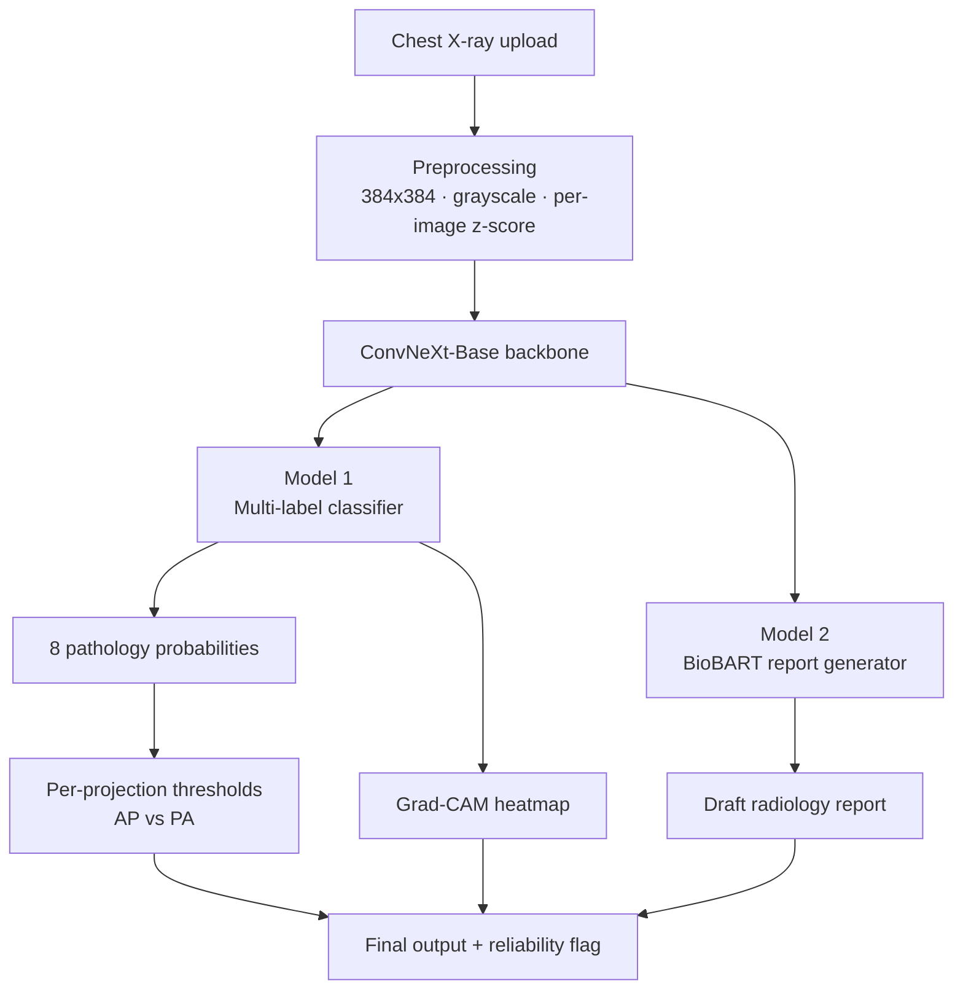
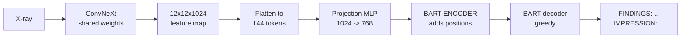
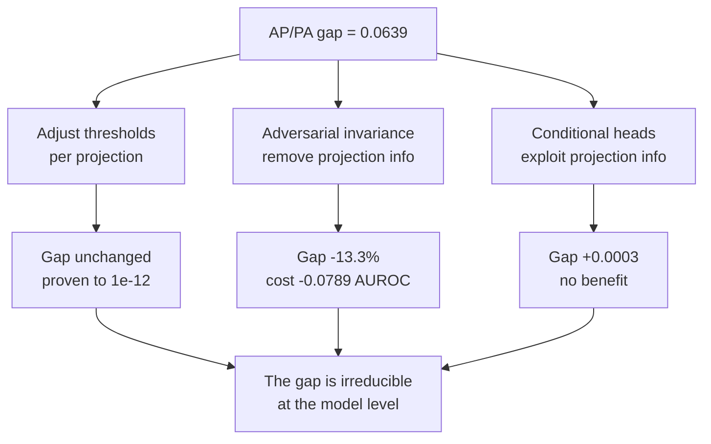

# Explainable AI System for Cardiovascular Disease Detection and Diagnosis

### Component: Cardiomegaly Detection with XAI and Automatic Report Generation

**Name:** Raagul Gananathan
**IT Number:** IT22130020

---

## Project Description

This component takes a chest X-ray and does three things with it: predicts whether the patient has cardiomegaly (an enlarged heart) along with seven other chest pathologies, shows you *where* on the image the model was looking when it made that call, and writes a draft radiology report in plain clinical language.

The reason for all three is that a prediction on its own isn't much use to a radiologist. A number like `Cardiomegaly: 0.94` tells you nothing about whether the model looked at the heart or at a piece of tubing in the corner of the film. So every prediction comes with a Grad-CAM heatmap and a written report, and — this is the part I ended up spending most of the project on — the system is honest about when it shouldn't be trusted.

I should say up front what this is and isn't. It's a decision-support prototype. It is not a diagnostic tool, it has not been clinically validated, and every output needs a radiologist to check it. Throughout this README I've tried to report what I actually measured rather than what I hoped for.

---

## Objectives

1. **Detect cardiomegaly** from a single frontal chest X-ray, with a confidence score rather than a bare yes/no.
2. **Detect seven co-occurring pathologies** in the same pass — edema, pleural effusion, atelectasis, consolidation, lung opacity, pneumonia, pneumothorax — because these rarely appear alone and a cardiomegaly-only model gives a misleading picture.
3. **Make the prediction explainable** with Grad-CAM, so a clinician can see whether the model attended to the cardiac silhouette or to something irrelevant.
4. **Generate a readable draft report** that reflects the actual image rather than reciting a generic template.
5. **Audit the system for fairness** across how the X-ray was taken. This started as a sanity check and turned into the main research contribution.

---

## Technologies Used

### AI and Deep Learning
| | |
|---|---|
| Vision backbone | ConvNeXt-Base (ImageNet-pretrained), 384×384 input |
| Text decoder | BioBART-v2-base (`GanjinZero/biobart-v2-base`) |
| Explainability | Grad-CAM on the final convolutional stage |
| Framework | PyTorch 2.x, torchvision, Hugging Face Transformers |
| Metrics | ROUGE, scikit-learn, custom bootstrap implementations |

### Backend
| | |
|---|---|
| API | FastAPI (Python) |
| Frontend | React |
| Image handling | Pillow, OpenCV |

### Training
| | |
|---|---|
| Hardware | Google Colab, NVIDIA L4 (24 GB) |
| Precision | bfloat16 mixed precision, `channels_last` memory format |
| Optimiser | AdamW, cosine schedule with warmup |
| Stability | EMA weight averaging, gradient clipping, non-finite-loss abort |
| Reliability | Resumable Drive checkpointing, automatic batch-size finder |

### Dataset
| | |
|---|---|
| Source | MIMIC-CXR / MIMIC-CXR-JPG (PhysioNet, credentialed) |
| Split | Patient-disjoint — 36,362 train / 4,474 val / **4,722 test** |
| Views | Frontal only (AP and PA) |
| Labels | 8 pathologies, text-adjudicated fusion of CheXpert labels + report text |

> ⚠️ MIMIC-CXR is credentialed data under a PhysioNet Data Use Agreement. No images, reports, or derived CSVs are in this repository — only code that regenerates them.

---

## How It Works

Two trained models share a single vision backbone.



### Model 1 — Image Classifier

A 384×384 chest X-ray goes through ConvNeXt-Base and comes out as eight independent probabilities. The head is a small MLP:

```
pooled features (1024)
   -> LayerNorm
   -> Dropout(0.3)
   -> Linear(1024 -> 512)
   -> GELU
   -> Dropout(0.198)
   -> Linear(512 -> 8)
```

Two things mattered more than I expected.

**Per-image z-score normalisation instead of ImageNet statistics.** ImageNet constants are written for natural RGB photographs. Chest X-rays are grayscale with a completely different intensity distribution, and using ImageNet normalisation made the variance across images **4.4× worse** than using the raw pixels. Normalising each image by its own mean and standard deviation fixed it.

**Class weighting.** Pneumothorax appears in about 4% of the training set. Without `pos_weight` the model is rewarded for simply never predicting it — and that is exactly what the first version learned to do.

**Grad-CAM** is computed on `features[7]`, the last convolutional stage. The gradient of the cardiomegaly logit is backpropagated to that layer, producing a 12×12 map of which regions drove the prediction. That map is upsampled and overlaid on the original X-ray.

### Model 2 — Report Generator



The 12×12 spatial map is flattened into **144 visual tokens** and projected from 1024 to 768 dimensions through a two-layer MLP:

```
LayerNorm(1024) -> Linear(1024->768) -> GELU -> Dropout -> Linear(768->768) -> LayerNorm
```

Those tokens go into BART as **`inputs_embeds`**, and that detail matters more than anything else in this model.

An earlier version passed them as `encoder_outputs` instead, which skips BART's pretrained encoder entirely. The decoder's cross-attention was pretrained to read encoder *outputs* with a specific scale and structure — hand it raw projected convolutional features and it simply can't use them, so it falls back on its language prior. The model was writing fluent, plausible reports from memory without meaningfully looking at the X-ray. Switching to `inputs_embeds` means BART's encoder actually runs and adds its own learned positional embeddings, so the decoder can tell the apex from the base.

The last ConvNeXt stage is **unfrozen at 0.1× the base learning rate**; earlier stages stay frozen. Freezing the whole trunk left too little capacity to adapt, and unfreezing all of it destroyed the features the classifier depends on.

Decoding is **greedy** (`num_beams=1`), `min_length=24`, `max_length=192`. I originally used beam search with 4 beams because that's the conventional choice. An ablation across six strategies showed greedy beat beam-4 on five of seven metrics, so I switched.

### Cleaning the reports — at the source, not the output

MIMIC-CXR reports are dictated in a workflow where the radiologist can see the patient's previous scans. So the text is full of *"compared to the prior study,"* *"unchanged from the previous exam,"* *"findings discussed with Dr. ___ at 3:45 PM."*

A model trained on that learns to say those things — about patients it has never seen, referencing scans that don't exist. **70.70%** of the raw training targets contained this language.

My first instinct was to strip it out of the generated text with regex. That works, but it papers over the problem: the model still spends capacity learning to produce text that gets deleted afterwards. Instead I clean the **training targets**, so the pattern is never learned. That's Stage 1 — 67 unit tests, 98.45% of the corpus retained, and fabricated prior-study references in generated reports now sit at exactly **0.0000** across all 4,722 test images.

### The shared backbone

Model 2's vision encoder is loaded from Model 1's trained checkpoint rather than trained from scratch. Both models therefore see identical visual features. If the classifier says cardiomegaly is present, the report generator is reasoning from the same evidence — they can't disagree because of a representation mismatch.

---

## Features

- ✅ **Cardiomegaly detection** — AUROC **0.9189**
- ✅ **7 co-pathologies** in the same forward pass
- ✅ **Grad-CAM heatmaps** per pathology
- ✅ **Report generation** with zero fabricated prior-study references
- ✅ **Acquisition fairness audit** — performance reported separately for AP and PA films
- ✅ **Per-projection operating points** — 73.3% less subgroup disparity at no accuracy cost
- ✅ **104 unit tests** across four modules, including controls built to falsify my own methods
- ✅ **Reproducible** — every stage is a self-contained notebook with a smoke-test mode

---

## Project Structure

```
Component_01/
│
├── cxr_transforms.py                       # preprocessing, single source of truth
├── chexpert_fusion.py                      # text-adjudicated label fusion
│
├── Stage1_Report_Target_Cleaning.ipynb     # strip prior-study language
├── Stage2_Image_Transforms.ipynb           # normalisation experiments
├── Stage4_Report_Generator.ipynb           # BioBART training
├── Stage4B_Decoding_Ablation.ipynb         # greedy vs beam search
├── Stage5_Classifier_Training.ipynb        # ConvNeXt training
│
├── stage6_acr.py                           # acquisition reliability  (38 tests)
├── Stage6_Acquisition_Conditioned_Reliability.ipynb
├── Stage6B_Validation.ipynb                # four-arm ablation
│
├── stage9_fairness.py                      # operating-point analysis (18 tests)
├── Stage9A_Operating_Point_Fairness.ipynb
│
├── stage9b_gradrev.py                      # gradient reversal        (28 tests)
├── Stage9B_Gradient_Reversal.ipynb
├── Stage9B_Lambda_Calibration.ipynb
│
├── stage10_conditional.py                  # conditional heads        (20 tests)
├── Stage10A_Feature_Probe.ipynb
│
├── MASTER_PLAN.md                          # full research record
├── RESULTS.md                              # results section
└── README.md
```

Data folders (`stage1_clean/`, `stage3_labels/`, `training_manifest/`) and `checkpoints/` are gitignored — they hold MIMIC-CXR derivatives and model weights.

---

## Model Performance

### Classifier — test set, n = 4,722

| Pathology | AUROC |
|---|---|
| Pleural Effusion | 0.9289 |
| **Cardiomegaly** | **0.9189** |
| Pneumothorax | 0.9141 |
| Edema | 0.9132 |
| Consolidation | 0.8167 |
| Atelectasis | 0.8096 |
| Pneumonia | 0.7959 |
| Lung Opacity | 0.7462 |
| **Mean** | **0.8554** |

Up from **0.8251** on the previous version.

### Report Generator

| Metric | Value |
|---|---|
| ROUGE-L | 0.2918 |
| Constant-baseline ROUGE-L | 0.2769 |
| **Margin over baseline** | **+0.0149** |
| Fabricated prior-study references | **0.0000** |
| Unique opening sentences (n=100) | 0.4100 *(was 0.1400)* |

**About that margin.** I report ROUGE-L alongside the score that a single fixed report gets when scored against every reference. That constant baseline is **0.2769**, which means most of a raw ROUGE-L score reflects how templated radiology reports are rather than anything the model understood. The honest measure of what the vision pipeline contributes is the **+0.0149** margin, not the 0.2918. This isn't specific to my model — [published work](https://journals.plos.org/plosone/article?id=10.1371%2Fjournal.pone.0259639) shows encoder-decoder report generators generally struggle to beat unconditioned baselines. I'd rather report it than bury it.

### ⚠️ Comparability

These numbers are **not** directly comparable to published MIMIC-CXR results, for three reasons I checked rather than assumed:

1. **The split is mine, not the official one.** It's patient-disjoint — zero subject, study, or image overlap, verified — but 98.3% of my test images are officially *training* data. Re-running on the official split isn't possible: only 155 official-test films are both available to me and free of my training patients.
2. **My reference text is cleaned.** Stage 1 removes prior-study language, which shifts the reference distribution. Cleaning alone moved the constant baseline from 0.2481 to 0.2769.
3. **Different filtering** — frontal-only, cardiomegaly-enriched.

Also, the clinical-efficacy F1 I currently report uses a project-internal extractor, **not CheXbert**. Until CheXbert is run it should not be placed in a table beside published numbers.

---

## Research Contribution — Acquisition Fairness

While auditing the classifier I found something I wasn't looking for.

Chest X-rays come in two projections. **PA** is the standard: the patient stands, the beam travels back-to-front. **AP** is used when the patient is too ill to stand, taken portably at the bedside. AP films magnify the heart, the scapulae overlie the lung fields, and image quality is lower.

The classifier is significantly worse on AP films:

| | AUROC |
|---|---|
| PA (standing) | 0.8864 |
| AP (bedside) | 0.8224 |
| **Gap** | **0.0639**, 95% CI [0.0491, 0.0790] |

Significant for 7 of 8 pathologies, same direction for all 8. **And AP films come from the sickest patients** — so the model is weakest exactly where it matters most. Pooled evaluation cannot see this at all.

I then tested three ways of fixing it.



**Finding 1 — the standard fairness metric can be gamed.** TPR Disparity, the metric the literature uses for this problem, is defined at a single decision threshold. AUROC is computed over the whole *ranking* of scores, and a threshold is just one cut through that ranking — so changing it per group **cannot reorder any case**. I used that to cut TPR Disparity by **73.3% at exactly zero accuracy cost**, while the real discrimination gap stayed identical to **1e-12**.

For comparison, [Pereira et al. (MIDL 2023)](https://proceedings.mlr.press/v227/pereira24a.html) reduced the same metric by 46.7% using adversarial training that required full retraining and cost 0.91 AUC points.

**Finding 2 — removing projection information doesn't help.** I reimplemented their gradient-reversal method on my own data and drove projection AUC to **0.5000** — complete invariance, better than the 0.61 they report. The gap moved only 0.0639 → 0.0554, at a cost of 0.0789 AUROC.

**Finding 3 — adding projection information doesn't help either.** The opposite strategy, giving the model projection-specific capacity, gained **+0.0003**. Nothing.

**Conclusion:** the AP/PA gap is irreducible at the representation level. It isn't a shortcut the model learned, and it isn't a metric artifact — AP images genuinely carry less usable information. It can't be engineered away downstream. It has to be addressed at acquisition, or by flagging low-reliability reads for human review instead of pretending parity exists.

---

## What Didn't Work

Including this because the failures took as long as the successes and shaped the final design.

| Idea | Outcome |
|---|---|
| **Acquisition-Conditioned Reliability** | Looked like a 90% fairness improvement. A proper four-arm control showed it was plain Platt scaling from 1999. Dropped. |
| **Sentence-Level Evidence Gating** | Four papers already do this, and better. Dropped after a prior-art search. |
| **Grad-CAM stability score** | Already published in 2021 — and they found Grad-CAM repeatability is poor (SSIM 0.12). Dropped. |
| **Conditional specialisation** | A cheap linear-probe gate returned +0.0003 before I committed the GPU budget. Cancelled. |
| **Label noise hypothesis** | I assumed weak co-pathology performance was caused by bad labels. Measuring the ceiling F1 (0.82–0.97 vs model 0.23–0.86) proved it wasn't. |

The pattern in all of these is the same: I assumed a number instead of measuring it. The controls that killed these ideas are in the repository alongside the ones that worked.

---

## References

1. Pereira S.C. et al. **Addressing Chest Radiograph Projection Bias in Deep Classification Models.** MIDL 2023, [PMLR 227:1199–1210](https://proceedings.mlr.press/v227/pereira24a.html)
2. Johnson A.E.W. et al. **MIMIC-CXR-JPG: A large publicly available database of labeled chest radiographs.** [arXiv:1901.07042](https://arxiv.org/pdf/1901.07042)
3. Irvin J. et al. **CheXpert: A Large Chest Radiograph Dataset with Uncertainty Labels.** AAAI 2019, [arXiv:1901.07031](https://arxiv.org/abs/1901.07031)
4. Liu Z. et al. **A ConvNet for the 2020s (ConvNeXt).** CVPR 2022, [arXiv:2201.03545](https://arxiv.org/abs/2201.03545)
5. Yuan H. et al. **BioBART: Pretraining and Evaluation of A Biomedical Generative Language Model.** BioNLP 2022, [arXiv:2204.03905](https://arxiv.org/abs/2204.03905)
6. Selvaraju R.R. et al. **Grad-CAM: Visual Explanations from Deep Networks via Gradient-based Localization.** ICCV 2017, [arXiv:1610.02391](https://arxiv.org/abs/1610.02391)
7. Ganin Y., Lempitsky V. **Unsupervised Domain Adaptation by Backpropagation.** ICML 2015, [arXiv:1409.7495](https://arxiv.org/abs/1409.7495)
8. Hardt M. et al. **Equality of Opportunity in Supervised Learning.** NeurIPS 2016, [arXiv:1610.02413](https://arxiv.org/abs/1610.02413)
9. Seyyed-Kalantari L. et al. **CheXclusion: Fairness gaps in deep chest X-ray classifiers.** [PSB 2021](https://psb.stanford.edu/psb-online/proceedings/psb21/seyyed-kalantari.pdf)
10. **Encoder-decoder models for chest X-ray report generation perform no better than unconditioned baselines.** [PLOS One 2021](https://journals.plos.org/plosone/article?id=10.1371%2Fjournal.pone.0259639)
11. Arun N. et al. **Assessing the Trustworthiness of Saliency Maps for Localizing Abnormalities in Medical Imaging.** *Radiology: AI* 2021
12. **The limits of fair medical imaging AI in real-world generalization.** [*Nature Medicine* 2024](https://www.nature.com/articles/s41591-024-03113-4)

Full prior-art analysis is in [`MASTER_PLAN.md`](MASTER_PLAN.md); detailed results are in [`RESULTS.md`](RESULTS.md).

---

## License

The **code** in this repository is released under the **MIT License**.

The **data is not**. MIMIC-CXR is credentialed and governed by the [PhysioNet Credentialed Health Data Use Agreement](https://physionet.org/content/mimic-cxr/view-dua/2.0.0/). No images, reports, or derived data files are distributed here. To reproduce this work you need your own PhysioNet credentialed access and completed CITI training.

Model weights are not distributed either, since they are derived from credentialed data.

---

## ⚕️ Disclaimer

This is a research prototype built for an undergraduate final-year project. It is **not** a medical device, has **not** undergone clinical validation, and must **not** be used for diagnosis or treatment decisions. Every output requires review by a qualified radiologist.

The system is measurably less accurate on AP (bedside) films — the ones taken of the sickest patients. That limitation is reported here rather than hidden.
